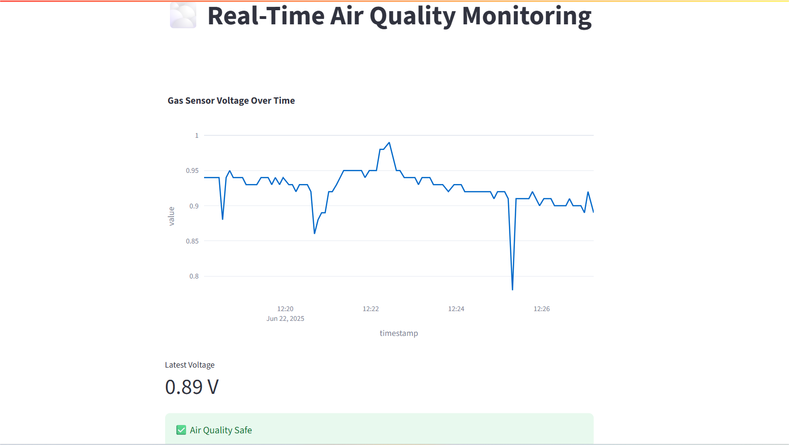
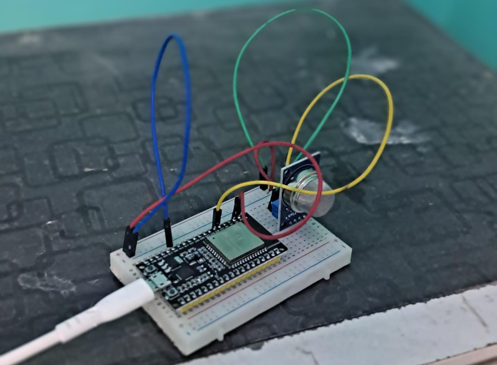
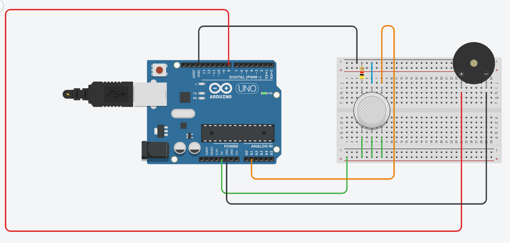

# 🌫️ Air Quality Monitoring System using ESP32 + Streamlit Dashboard

A real-time air quality monitoring system using the **MQ135 gas sensor** and **ESP32**, with a live dashboard built using **Flask**, **Pandas**, and **Streamlit**. The system visualizes and logs air pollutant levels (as voltage readings), providing an accessible way to track air quality indoors or in industrial environments.

---

## 🎯 Project Purpose

To design a smart, affordable, and real-time IoT system that:
- Detects poor air quality conditions using gas sensors.
- Sends data over WiFi using the ESP32.
- Visualizes the data in a web dashboard using Streamlit.
- Alerts and logs dangerous air conditions for analysis.

---

## 🔧 Components Used

| Component         | Description                     |
|------------------|---------------------------------|
| ESP32 Dev Board  | Main microcontroller with WiFi  |
| MQ135 Gas Sensor | Detects air pollutants like CO₂, NH₃, benzene |
| Jumper Wires     | For connections                 |
| USB Cable        | Power + Serial communication    |

---

## 💻 Software and Libraries Used

- **Arduino IDE** for ESP32 programming
- **Python 3.10+**
  - `Flask` – for REST API
  - `Pandas` – for data logging
  - `Streamlit` – for dashboard visualization
  - `Plotly` – for interactive plots

---

## 🧪 How MQ135 Sensor Works

The MQ135 is a gas sensor that:
- Contains a chemical-sensitive layer (SnO₂) whose resistance varies with gas concentration.
- Internally, a heating coil keeps the sensor at operating temperature.
- As harmful gases increase, resistance decreases → voltage output increases.
- Analog output is read by the ESP32’s ADC pin and converted to a voltage level.
  
> You can calibrate the sensor in clean air to establish a baseline for better accuracy.

---

## 🔄 Project Workflow

1. **ESP32 reads analog signal** from MQ135 and converts it to voltage.
2. **ESP32 sends voltage value** to a local Flask server via HTTP POST request every 5 seconds.
3. **Flask backend receives data**, logs it into a CSV file using Pandas.
4. **Streamlit dashboard reads the CSV**, and displays real-time charts.

---

## 📸 Screenshots

### 🔹 Streamlit Dashboard  
Shows live plot of air quality voltage readings.

---

### 🔹 Physical Hardware Setup  
Connection of MQ135 to ESP32 on breadboard.

---

### 🔹 Circuit Diagram (Tinkercad)  
Schematic for reproducibility and simulation.

---

## 📈 Real-Time Data Visualization

- Line chart shows voltage trends over time.
- Higher voltage indicates increased gas concentration.
- Thresholds can be added for alerting dangerous levels.

---

## 🌍 Impact

- Ideal for **indoor air monitoring**, **labs**, **schools**, or **industrial environments**.
- Forms the foundation for larger systems involving:
  - Predictive health alerts
  - Integration with HVAC systems
  - Industrial emission compliance

---
